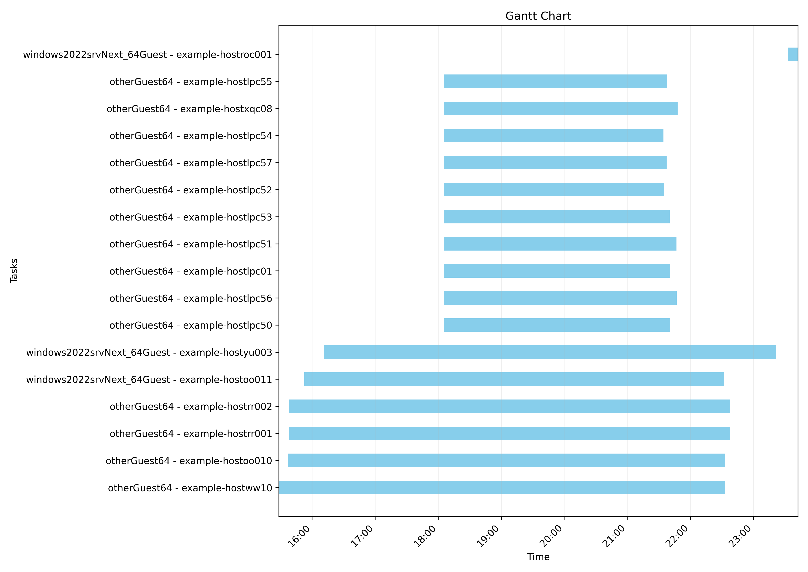

# VM Migration Analyzer

> [!WARNING]
> All of the metrics herein are constrained by what the MTV tool collects. That means things such as Windows reboot times are NOT included as the Migration plans do not rack this data!

**VM Migration Analyzer** is a Python toolkit designed to process, analyze, and visualize virtual machine (VM) migration data. It parses OpenShift's [MTV](https://docs.redhat.com/en/documentation/migration_toolkit_for_virtualization/2.8) migration plans YAML files, calculates effective migration times, analyzes concurrent migrations, and produces reports with visualizations. This tool is particularly useful for migration teams who need to understand migration performance metrics and optimize future migration waves.

## Features

- **YAML Migration Plan Processing:** Parses VM migration plans to extract critical timing and resource information
- **Smart Migration Time Analysis:** Detects significant drops in precopy duration to accurately calculate effective migration times
- **Comprehensive Reporting:** Generates detailed reports on successful and failed migrations, OS distribution, and performance metrics
- **Concurrency Analysis:** Tracks and analyzes concurrent migrations to identify peaks, patterns, and resource utilization
- **Visualization:** Creates Gantt charts to visualize migration timelines and identify overlapping migrations
- **Performance Metrics:** Calculates key indicators like transfer speeds, average durations, and resource efficiency

## Installation

VM Migration Analyzer can be installed directly from GitHub using pip, or executed from a cloned repository.

### Container

> [!NOTE]
> Matplotlib cannot currently show you the chart interactively without appropriate configuration of your local container engine. You should mount a volume so that the image can be exported out of the container.

#### Understanding Podman Volume Mounts

Podman volume mounts allow you to share files and directories between your local machine and the container. This is essential for:
- **Input Files:** Getting your migration YAML files into the container
- **Output Files:** Retrieving generated charts and reports from the container

**Volume Mount Syntax:** `-v local_path:container_path`
- `local_path`: File or directory on your computer
- `container_path`: Where it appears inside the container
- The container can read from and write to these mounted locations

#### Building

There is a container file located in this repository. The build is small and has been tested with podman.

```
podman build . -t mtv-parser
```

#### Running with Single File

To analyze a single migration plan file:

```
# Mount your YAML file over the sample file location
podman run -v ./my_migration_plan.yaml:/mtv-parser/examples/vm-plans-sample2.yaml \
           -v /your/local/chart/dir:/mtv-parser/charts \
           mtv-parser
```

**Explanation:**
- `-v ./my_migration_plan.yaml:/mtv-parser/examples/vm-plans-sample2.yaml`: This mounts your local YAML file directly over the sample file inside the container, replacing it
- `-v /your/local/chart/dir:/mtv-parser/charts`: This mounts a local directory to receive the generated charts and any output files

#### Running with Multiple Files

To analyze multiple migration plan files:

```
# Mount your directory containing multiple YAML files
podman run -v /path/to/your/yaml/files:/mtv-parser/plans/multiple \
           -v /your/local/chart/dir:/mtv-parser/charts \
           mtv-parser
```

**Explanation:**
- `-v /path/to/your/yaml/files:/mtv-parser/plans/multiple`: This mounts your local directory containing multiple YAML files to the container's multiple files directory
- All `.yaml` and `.yml` files in your local directory will be processed together
- The analyzer automatically detects multiple files and merges them for comprehensive analysis

#### Using the Prebuilt Container

You can pull from the pre-built container from Quay. There are both `ubi9-stable` and `ubi9-dev` tags. The `dev` is considered unstable.

**Single File Analysis:**
```
podman run -v ./my_migration_plan.yaml:/mtv-parser/examples/vm-plans-sample2.yaml \
           -v /your/local/chart/dir:/mtv-parser/charts \
           quay.io/sovens/rhtools/mtv-parser:ubi9-stable
```

**Multiple File Analysis:**
```
podman run -v /path/to/your/yaml/files:/mtv-parser/plans/multiple \
           -v /your/local/chart/dir:/mtv-parser/charts \
           quay.io/sovens/rhtools/mtv-parser:ubi9-stable
```
#### Volume Mount Troubleshooting

**Common Issues:**
- **File not found:** Ensure your local file path is correct and the file exists
- **Permission denied:** Make sure Podman has permission to read your files
- **Empty output:** Check that your output directory exists and is writable

**Verifying Mounts:**
You can verify your files are mounted correctly by running:
```
podman run -v ./my_file.yaml:/mtv-parser/plans/single/vm-plans-sample2.yaml \
           mtv-parser ls -la /mtv-parser/plans/single/
```

### Using pip

```bash
pip install git+https://github.com/rhtools/mtv-parser.git
```

### From GitHub repository

```bash
git clone https://github.com/rhtools/mtv-parser.git
cd mtv-parser
pip install -r requirements.txt
python mtv_parser/mtv_plan_parser.py
```

## Required Dependencies

- PyYAML: For parsing YAML migration plan files
- matplotlib: For generating Gantt chart visualizations
- tabulate: For formatting CLI output tables

## Input File Format

The analyzer expects YAML files containing VM migration plan data with the following structure:

- Migration metadata and specifications
- VM details including operating system information
- Migration status with timestamps
- Pipeline phases including disk transfer data
- Warm migration details with precopy information

Example structure (simplified):

```yaml
items:
  - metadata:
      name: migration-plan-1
    spec:
      vms:
        - name: vm1
    status:
      migration:
        started: "2023-04-01T10:00:00"
        completed: "2023-04-01T11:30:00"
        vms:
          - name: vm1
            operatingSystem: "Windows"
            pipeline:
              - name: "DiskTransfer"
                started: "2023-04-01T10:00:00"
                completed: "2023-04-01T10:45:00"
                progress:
                  total: 102400
            warm:
              precopies:
                - start: "2023-04-01T10:00:00"
                  end: "2023-04-01T10:15:00"
            conditions:
              - type: "Succeeded"
```

In the simplest form this can be obtained by running the following on an OpenShift Cluster
```
oc get plan -A -o yaml > migration_plan.yaml
```

> [!NOTE]
> There are a couple of data samples in the `examples` folder in this repo.

## Usage

### Single File Analysis

To analyze a single VM migration data file:

```
python mtv_parser/mtv_plan_parser.py
```

By default, the script reads from `plans/single/vm-plan-sample.yaml`. You can modify the file path in the script to point to your own YAML files.

### Multiple File Analysis

The analyzer now supports processing multiple migration plan files from a directory to generate comprehensive reports across multiple migration waves or batches.

**Directory Structure:**
- Place multiple YAML files in the `plans/multiple/` directory
- The analyzer will automatically detect and process all `.yaml` and `.yml` files in this directory
- If multiple files are found, they will be merged and analyzed as a single dataset
- If only one file is found in the multiple directory, it will be processed normally
- If no files are found, the analyzer falls back to the single sample file

**Benefits of Multiple File Processing:**
- **Comprehensive Reporting:** Get overall statistics across all migration waves
- **Accurate Concurrency Analysis:** See true concurrent migration patterns across multiple plans
- **Resource Planning:** Better understand total migration capacity and timing
- **Historical Analysis:** Track migration performance across different time periods

The merged analysis provides accurate overall statistics while maintaining the same report structure you're familiar with.

> [!IMPORTANT]
> Currently no command-line arguments are accepted. You need to either place your files in the appropriate directories or edit the `mtv_plan_parser.py` to update which files it processes. In the future, this will likely be enhanced with proper CLI argument support.


## Module Structure

| Module | Description |
|--------|-------------|
| `mtv_plan_parser.py` | Main script that orchestrates the analysis process |
| `migration_information.py` | Core class `MigrationAnalyzer` for extracting and analyzing VM migration data |
| `clioutput.py` | Handles formatting and display of results to the command line |
| `visualization.py` | Creates Gantt charts for visualizing migration timelines |

## Key Methods of MigrationAnalyzer Class

### MigrationAnalyzer Class

**`calculate_effective_migration_time(vm, entry)`**
- Analyzes precopy phases to determine when migration effectively completed
- Detects significant drops in precopy duration to mark effective completion
- Falls back to regular migration times if no precopies are found

**`extract_vm_information(vm, effective_duration)`**
- Extracts essential VM data including OS, disk size, and transfer times
- Organizes information into a standardized dictionary structure
- Determines the VM's migration window based on the effective duration

**`analyze_concurrent_migrations(migration_plan_by_hour, max_concurrent_total, peak_time)`**
- Tracks VM migrations over time to analyze concurrency patterns
- Identifies peak concurrent migrations and their timing
- Calculates hourly statistics and average concurrent VMs

**`get_migration_success_info(mtv_plan_data, all_vms)`**
- Processes migration data and extracts success/failure information
- Categorizes migrations into successful and failed lists
- Tracks migration windows for planning

**`prepare_migration_information(migrations, active_migration_hours)`**
- Calculates and organizes overall migration statistics
- Computes various statistics like average time, total VMs, disk size
- Identifies the longest migration plan and calculates cold/warm migration counts

**`sort_migration_events(all_vms)`**
- Processes migration events and sorts them chronologically
- Creates a sequence of start and end events for visualization

### MTV Plan Parser Module

**`main()`**
- Primary function that orchestrates the entire analysis workflow
- Initializes the MigrationAnalyzer class
- Processes YAML data and generates reports and visualizations

### CLI Output Module

The `CLIOutput` class provides methods for generating formatted reports:

- `migration_output()`: Generates reports on successful or failed migrations
- `operating_system_report()`: Creates breakdowns by operating system
- `generate_concurrency_report()`: Produces concurrency analysis reports

### Visualization Module

**`plot_gantt_chart(data)`**
- Creates a visualization of VM migrations as a Gantt chart
- Shows timing relationships between different migrations
- Saves the chart as a PNG file

## Example Output

The analyzer produces several reports in one output:

```
MIGRATION REPORT
================

The number of successful migration plans:        7
-----------------------------------------
The number of vms:                               19
Number of Warm Migration Plans:                  6
Number of Cold Migration Plans:                  1
Number of Cold Migrated VMs:                     2
Number of Warm Migrated VMs:                     17
Plan with longest runtime:                       105289-group-3
Longest runtime in minutes:                      430.3
Total disk size in longest plan (GB):            532.0
Transferred data per hour in longest plan (GB):  1.2
Shortest runtime in minutes:                     9.5
Average runtime in minutes:                      275.3
Average disk size (GB):                          701.6
Average transfer per hour (GB):                  152.9
Total Disk Size Migrated (GB):                   4911.0
Total Migration Hours (approx):                  10


OS REPORT
=========

Report for windows2022srvNext_64Guest:
--------------------------------------
Number of VMs:                             3
Total Disk Size (GB):                    992

Report for otherGuest64:
------------------------
Number of VMs:                            16
Total Disk Size (GB):                   3919


CONCURRENCY REPORT
==================

Peak concurrent VMs:                           16
Peak time:                                     2025-03-21 18:00:00+00:00
Average concurrent VMs:                        10


Maximum concurrent VMs by OS type:
----------------------------------


Hourly concurrent VMs for Migration Window 1:
---------------------------------------------
2025-03-21 15:00:                              5 VMs
2025-03-21 16:00:                              6 VMs
2025-03-21 17:00:                              6 VMs
2025-03-21 18:00:                              16 VMs
2025-03-21 19:00:                              16 VMs
2025-03-21 20:00:                              16 VMs
2025-03-21 21:00:                              16 VMs
2025-03-21 22:00:                              6 VMs
2025-03-21 23:00:                              2 VMs
2025-03-22 12:00:                              2 VMs
```

### Gantt Chart Visualization
The tool generates a Gantt chart visualization showing VM migrations over time. This chart helps identify:
- Migration overlaps and patterns
- Peak migration periods
- OS-specific migration behaviors

The chart is saved as `migration_gantt_chart.png` in the current directory.

Below is an example


The analyzer uses the following to determine the true effective migration time:

1. Analyzes all precopy phases for each VM
2. Identifies when precopy duration drops significantly (indicating data sync is nearly complete)
3. Calculates migration time from first precopy to the significant drop point
4. Falls back to total migration time if no significant drop is detected

The thought here is that while not 100% accurate due to the final copy of RAM to disk, there are many who start a migration plan then walk away and come back hours after the copies have completed. MTV's plan will officially be the entire time until the migration has been cut over. This is inaccurate and skews the metrics badly. By watching for a sharp drop off in precopy time we can "guess" at how long a cutover would have taken as if the cutover happened as soon as the VM had transferred all of the initial data.

### Concurrency Analysis

The tool provides insights into migration concurrency:

- Tracks which VMs are migrating at any given time
- Identifies peak concurrency periods
- Detects significant drops in concurrency
- Calculates hourly migration loads
- Breaks down concurrency by operating system

## File Processing Modes

The analyzer supports two distinct processing modes:

### Single File Mode
- Processes one migration plan file
- Suitable for analyzing individual migration waves
- Default file location: `examples/vm-plans-sample2.yaml`

### Multiple File Mode  
- Automatically activated when multiple YAML files are detected in `plans/multiple/`
- Merges all migration data before analysis
- Provides comprehensive statistics across all files
- Maintains accurate concurrency analysis across multiple migration plans

**Data Merging Process:**
1. Scans `plans/multiple/` directory for `.yaml` and `.yml` files
2. Loads each file and extracts the `items` array
3. Combines all items into a single dataset
4. Processes the merged data using the same analysis logic
5. Generates reports that reflect the complete migration picture


## Contributing

Contributions to VM Migration Analyzer are welcome! The codebase is organized into modules with clear responsibilities:

- `migration_information.py`: Core MigrationAnalyzer class with analysis methods
- `mtv_plan_parser.py`: Main entry point and workflow orchestration
- `clioutput.py`: Output formatting and report generation
- `visualization.py`: Data visualization with matplotlib

To contribute:
1. Fork the repository
2. Create a feature branch (`git checkout -b feature/new-analysis`)
3. Commit your changes (`git commit -m 'Add new analysis capability'`)
4. Push to the branch (`git push origin feature/new-analysis`)
5. Open a Pull Request
